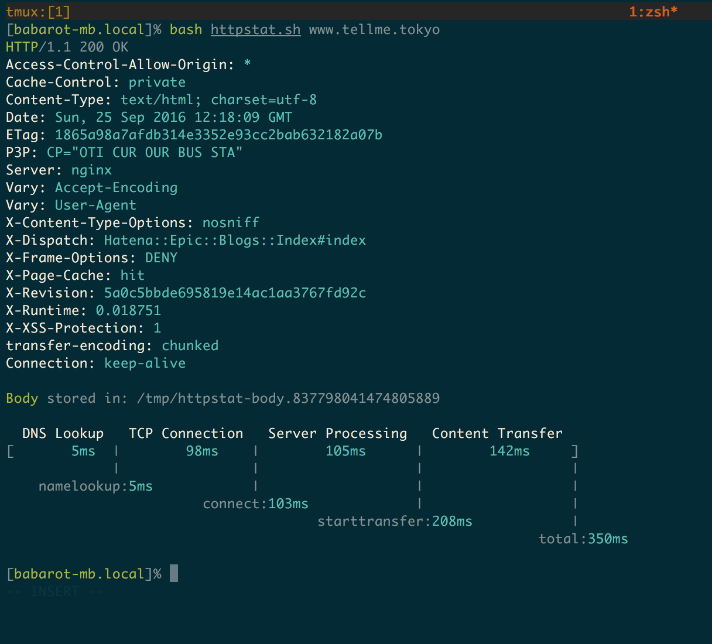

httpstat
===

curl statistics made simple.

<p align="center">

</p>

## Usage

```console
$ bash ./httpstat.sh --help
Usage: httpstat URL [CURL_OPTIONS]
       httpstat -h | --help
       httpstat --version
Arguments:
  URL     url to request, could be with or without `http(s)://` prefix
Options:
  CURL_OPTIONS  any curl supported options, except for -w -D -o -S -s,
                which are already used internally.
  -h --help     show this screen.
  --version     show version.
Environments:
  HTTPSTAT_SHOW_BODY    By default httpstat will write response body
                        in a tempfile, but you can let it print out by setting
                        this variable to `true`.
  HTTPSTAT_SHOW_SPEED   set to `true` to show download and upload speed.
```

This `httpstat` is written by bash only. Do you have `/bin/bash` and the like?

## Installation

There are two ways to get httpstat:

- Download the script directly:
	- `wget https://raw.githubusercontent.com/b4b4r07/httpstat/master/httpstat.sh`
	- `curl https://raw.githubusercontent.com/b4b4r07/httpstat/master/httpstat.sh >httpstat.sh`
- Install through [zplug](https://github.com/zplug/zplug): 

    ```zsh
    zplug "b4b4r07/httpstat", \
        as:command, \
        use:'(*).sh', \
        rename-to:'$1'
    ```

## Implementations

Many thanks.

- <https://github.com/reorx/httpstat>
- <https://github.com/davecheney/httpstat>
- <https://github.com/yosuke-furukawa/httpstat>
- <https://github.com/tcnksm/go-httpstat>

## Author

b4b4r07

## License

[MIT](http://b4b4r07.mit-license.org)
