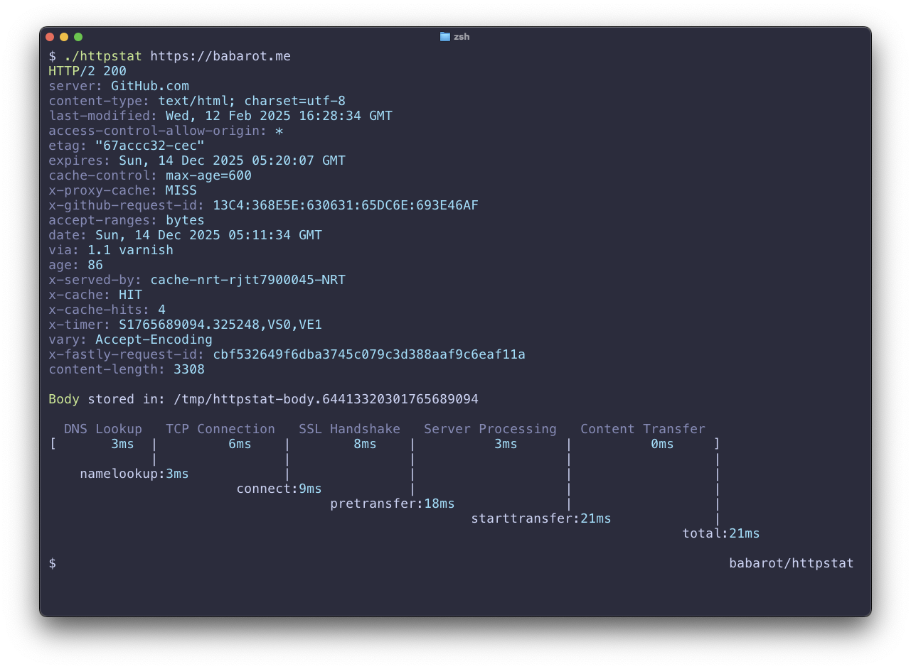

httpstat
===

curl statistics made simple.

<p align="center">

</p>

## Overview

`httpstat` is a bash script that visualizes curl statistics in a human-readable format. It breaks down the HTTP request into individual phases (DNS lookup, TCP connection, SSL handshake, etc.) and displays the time spent in each phase, helping you identify performance bottlenecks.

## Requirements

- **bash** (version 3.0 or later)
- **curl** (with `-w` write-out support)
- **perl** (for header colorization)
- **bc** or **awk** (for floating-point calculations; awk is used as fallback if bc is not available)

## Usage

```console
$ httpstat URL [CURL_OPTIONS]
$ httpstat -h | --help
$ httpstat --version
```

### Arguments

| Argument | Description |
|----------|-------------|
| `URL` | The URL to request. Can be with or without `http(s)://` prefix |
| `CURL_OPTIONS` | Any curl supported options, except for `-w`, `-D`, `-o`, `-S`, `-s` which are used internally |

### Options

| Option | Description |
|--------|-------------|
| `-h`, `--help` | Show help message |
| `--version` | Show version information |

### Environment Variables

| Variable | Description |
|----------|-------------|
| `HTTPSTAT_SHOW_BODY` | Set to `true` to print the response body to stdout. By default, the body is saved to a temporary file |
| `HTTPSTAT_SHOW_SPEED` | Set to `true` to display download and upload speed in KiB/s |

## Examples

### Basic Usage

```bash
# Simple GET request
httpstat example.com

# Request with explicit HTTPS
httpstat https://example.com

# Request with custom headers
httpstat https://api.example.com -H "Authorization: Bearer token"

# POST request with data
httpstat https://api.example.com -X POST -d '{"key": "value"}'

# Follow redirects
httpstat example.com -L
```

### With Environment Variables

```bash
# Show response body
HTTPSTAT_SHOW_BODY=true httpstat example.com

# Show download/upload speed
HTTPSTAT_SHOW_SPEED=true httpstat example.com

# Combine both
HTTPSTAT_SHOW_BODY=true HTTPSTAT_SHOW_SPEED=true httpstat example.com
```

## Understanding the Output

### Timing Metrics

httpstat displays the following timing metrics:

| Metric | Description |
|--------|-------------|
| **DNS Lookup** | Time spent resolving the domain name to an IP address |
| **TCP Connection** | Time spent establishing a TCP connection to the server |
| **SSL Handshake** | Time spent performing the TLS/SSL handshake (HTTPS only) |
| **Server Processing** | Time from the request being sent to receiving the first byte of response |
| **Content Transfer** | Time spent downloading the response body |

### Cumulative Timings

The output also shows cumulative timings from curl:

| Timing | Description |
|--------|-------------|
| `namelookup` | Time until DNS resolution completed |
| `connect` | Time until TCP connection established |
| `pretransfer` | Time until ready to start transfer (includes SSL for HTTPS) |
| `starttransfer` | Time until first byte received (TTFB - Time To First Byte) |
| `total` | Total time for the entire request |

### HTTP vs HTTPS Output

For **HTTP** requests, the output shows 4 phases:

```
  DNS Lookup   TCP Connection   Server Processing   Content Transfer
[   23ms     |      35ms      |       120ms       |       45ms      ]
```

For **HTTPS** requests, the output includes an additional SSL Handshake phase:

```
  DNS Lookup   TCP Connection   SSL Handshake   Server Processing   Content Transfer
[   23ms     |      35ms      |     85ms      |       120ms       |       45ms      ]
```

### Response Information

- **HTTP Headers**: Displayed with syntax highlighting at the top of the output
- **Response Body**: Saved to a temporary file (path shown in output) unless `HTTPSTAT_SHOW_BODY=true`

## Installation

There are two ways to get httpstat:

- Download the script directly:
	- `wget https://raw.githubusercontent.com/babarot/httpstat/master/httpstat`
	- `curl -o httpstat https://raw.githubusercontent.com/babarot/httpstat/master/httpstat`
- Install through [zplug](https://github.com/zplug/zplug):

    ```zsh
    zplug "babarot/httpstat", as:command, use:httpstat
    ```

## Troubleshooting

### Common Issues

**"too few arguments" error**

Make sure you provide a URL:
```bash
httpstat example.com  # Correct
httpstat              # Error: too few arguments
```

**SSL Handshake time shows 0ms for HTTPS**

This can happen if:
- The connection is reusing an existing SSL session
- There's a proxy handling SSL termination

**Output not colored**

Ensure your terminal supports ANSI color codes. If using in a script or pipe, colors may be disabled.

**bc: command not found**

The script will automatically fall back to awk for calculations. No action needed, but you can install bc for slightly better precision:
```bash
# macOS
brew install bc

# Debian/Ubuntu
apt-get install bc

# RHEL/CentOS
yum install bc
```

### Tips

- Use `-L` flag to follow redirects: `httpstat example.com -L`
- For APIs requiring authentication, pass headers: `httpstat api.example.com -H "Authorization: Bearer TOKEN"`
- To test POST requests: `httpstat api.example.com -X POST -d "data"`
- Check SSL certificate issues: `httpstat https://example.com -k` (skip certificate verification)

## Related Projects

Other implementations of httpstat in various languages:

| Language | Repository |
|----------|------------|
| Python | [reorx/httpstat](https://github.com/reorx/httpstat) |
| Go | [davecheney/httpstat](https://github.com/davecheney/httpstat) |
| Node.js | [yosuke-furukawa/httpstat](https://github.com/yosuke-furukawa/httpstat) |
| Go (library) | [tcnksm/go-httpstat](https://github.com/tcnksm/go-httpstat) |

## Author

[@babarot](https://github.com/babarot)

## License

[MIT](https://b4b4r07.mit-license.org/)
